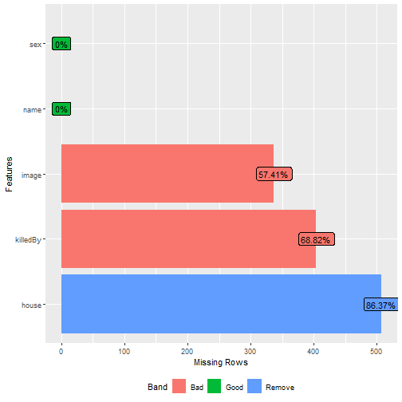

```{r setup, include=FALSE}
options(htmltools.dir.version = FALSE)
knitr::opts_chunk$set(collapse = TRUE,
                      fig.retina = 3)

library(tidyverse)
library(xaringanExtra)
xaringanExtra::use_panelset()
xaringanExtra::use_share_again()
xaringanExtra::style_share_again(
  share_buttons = c("twitter", "pocket")
)
```

```{r xaringanExtra, echo=FALSE}
xaringanExtra::use_xaringan_extra(c("tile_view", "animate_css", "Panelset","scribble"))
```

```{r share-again, echo=FALSE}
xaringanExtra::use_share_again()
```

```{r xaringan-panelset, echo=FALSE}
xaringanExtra::use_panelset()
```


```{r icons, message=FALSE, warning=FALSE,echo=FALSE}

library(icons)
```

```{r broadcast, echo=FALSE}
xaringanExtra::use_broadcast()
```

```{r packages, include=FALSE}
library(countdown)
library(ymlthis)
library(tidyverse)
library(janitor)
library(knitr)
library(gt)
library(emo)
library(dplyr)
library(here)
```

```{r importation reelles , include=FALSE}

chemin_donnees <- here("donnees","In")
apparitions <- read.csv(here(chemin_donnees, "apparitions.csv"))


episodes <- read.csv(here(chemin_donnees,"episodes.csv"))
perso <- read.csv(here(chemin_donnees,"personnages.csv"))
scenes <- read.csv(here(chemin_donnees,"scenes.csv"))

```


class: title-slide, right, middle
background-image: url("images/couv2.jpg")
background-position: right
background-size: contain
background-color: #f5b356

.pull-left[

# `r rmarkdown::metadata$title`

## `r rmarkdown::metadata$subtitle`

### `r rmarkdown::metadata$author`

### `r rmarkdown::metadata$date`
]
???
On vous laisse nous donner des idées [ici](https://pad.fdn.fr/IntermediR-1)


---
class: inverse, center, middle

# Il était une fois ...


---
# Qu'est-ce que R

- R est le principal logiciel libre permettant de faire des traitements de données statistiques
- Il est issu du langage S développé au sein du laboratoire AT&T Bell
- S − − − >> R et Splus (commercialisé par Insightfull, puis [tibco](https://docs.tibco.com/products/tibco-spotfire-s-8-2-0), [un peu d'histoire](https://yihui.org/en/2019/05/review-of-s-plus/)
- logiciel R créé dans les années 1990 par Robert Gentleman & Ross Ihaka (Auckland, NZ)
- Développé depuis 1997 par la ”R-core team” (21 personnes)
- Version 1.0.0 en 2000
- Version actuelle la 4

---
## R

- Est un logiciel et un langage libre (projet GNU)
http://www.gnu.org/

- Libre : fondé sur l’ouverture et la transparence et la redistribution. R est donc :

  + Ouvert : tout utilisateur peut ajouter ses fonctions personnelles
  + Transparent : l’utilisateur a accès au code source des fonctions
  
- R est aussi
  + Multiplateforme : Windows, Linux Mac
  + Gratuit
  + En évolution constante
  + Interprété : toute commande est exécutée immédiatement
  
---

# Installation de R

 https://cran.r-project.org/bin/windows/base/ 

# Ouverture de R 


---


# Installation de R studio

 https://rstudio.com/products/rstudio/download/

---

# Aspect pratique

1- Creer un dossier pour l'ensemble des fichiers qui vont être créés au cours de cette séance de formation

2- Dans ce dossier creer un dossier Donnees . Ce dossier contiendra deux dossiers : "In", "Out"

3- Creer un nouveau projet  Rstudio dans ce dossier 


---
# Les données
Les données tabulaires utilisées ont été collectées par Jeffrey Lancaster et sont issues de [ce projet](https://jeffreylancaster.github.io/game-of-thrones/).  Pour débuter, on va utiliser les données d'[Etienne Come](https://github.com/comeetie/got/tree/master/data) 

Elles sont à disposition [ici](https://gitlab.huma-num.fr/emorand/stat-r/-/tree/master/Donnees/In)


---


class: middle
background-image: url(images/ours.jpg)
background-position: right
background-size: 70%
background-color: #7899d4ff


# Importation des données


--


.pull-left[

> 1. importer des données

> 1.  vérifier l'importation

>1.  ce qu'on peut importer aussi


.footnote[[Image from NASA](https://www.rawpixel.com/image/441511/polar-bear)]

]
???


Image : ours polaire
https://www.rawpixel.com/image/441511/polar-bear

licence libre , gouvernement américain


---


class: inverse, center, middle

# Première importation


---
# Première importation

On importe les données concernant les personnages

1. A l'aide d'Import Dataset from text base
2.  ... from text reader

---

## Une ligne de code 
Le menu deroulant conduit à :
```{r}

personnages <- read.csv("~/Dossier_tout_compris/Ined/Formation/initiation_R/site/donnees/In/personnages.csv", stringsAsFactors=TRUE)


```


**Description d'une fonction**

1. la fonction read.csv() : rendre les données accessibles dans R
read.csv() est appliquée au fichier
~/Dossier_tout_compris/Ined/Formation/initiation_R/site/donnees/In/personnages.csv"

2.les options

- header : intitulés des variables
- sep : séparateur de colonnes
- dec : séparateur de décimal


Le jeu de données est stocké dans ”personnages”


---

# Réaliser l'importation des données

On importe les données (chemin relatif et absolu)

```{r importation_absolue, echo=TRUE}

apparitions <- read.csv("C:/Users/elisa/Documents/Dossier_tout_compris/Ined/Formation/R intermediaire/Poly/donnees/in/apparitions.csv")
```

```{r importation reelle, echo=FALSE}
chemin<-"C:/Users/elisa/Documents/Dossier_tout_compris/Ined/Formation/initiation_R/site/donnees/In/"
apparitions <- read.csv(paste(chemin,"apparitions.csv",sep="/"))
episodes <- read.csv(paste(chemin,"episodes.csv",sep="/"))
perso <- read.csv(paste(chemin,"personnages.csv",sep="/"))

scenes <- read.csv(paste(chemin,"scenes.csv",sep="/"))

```

Chemin relatif , plus lisible et plus facile à transferer

```{r import_relatif, echo=TRUE, eval=FALSE}
apparitions <- read.csv("Donnees/in/apparitions.csv")
episodes <- read.csv("Donnees/in/episodes.csv")
perso <- read.csv("Donnees/in/personnages.csv")
scenes <- read.csv("Donnees/in/scenes.csv")
```

Le jeu de données sur lequel on va maintenant travailler s'appelle perso

.footnote[setwd(), here] 
???

setwd et here

https://here.r-lib.org/
---

# Vérifier l'importation 

Vérifie avant d'importer !

Type de fichier , séparateur, decimale , etc...


Et après :


```{r, echo=FALSE}
library(countdown)
countdown::countdown(1, 30, id = "special_timer")
```

---

class: inverse, middle

# A la recherche des  : 

--

  - valeurs manquantes ; 
  
--

  - données inconnues ; 
  
--

  - piste de recodage ;
  


---

# Dans un premier temps

str()
summary()

---

# Identifier les valeurs manquantes


A l'ancienne, il existe une commande 

**is.na()** et en utilisant **which()**

Par etape !

1. identifier une colonne

1. verifier quels élements sont manquants

1. identifier le(s) lignes pour lesquelles l'information est manquante

---
# Decrire une variable qualitative : la modalité valeur manquante


<small>
On s'interesse aux maisons. 

On décrit  :
```{r table, eval=FALSE}
table(perso$house)

```
```{r jolitable,echo=FALSE, results="asis"}

knitr::kable(t(table(perso$house)), 'html')
```


Il y a 587 personnages et le descriptif ne laisse que peu de doute sur le fait la variable n'est pas renseignée pour tous

```{r tablena, eval=FALSE}
table(perso$house,useNA="always")

```

</small>

Combien de valeurs manquantes ?

---
# Verifier quels élements sont manquants

La fonction is. na() va vérifier pour chaque élément du vecteur s'il est présent ou non . On obtient donc un vecteur de résultat de vérification du test 


```{r isna,eval=FALSE}
is.na(perso$house)
# le résultat est un vecteur utilisable comme tel 
valeurs_manquantes<-is.na(perso$house)
```


```{r isna_eval,echo=FALSE}
valeurs_manquantes<-is.na(perso$house)
```

---
# Lignes manquantes 


Identifier le(s) lignes pour lesquelles l'information est manquante
```{r,echo=FALSE,highlight.output =c(2,3)}
head(perso)[,-5]

```

A partir du vecteur précédent et de la commande **which()** , on peut connaitre le numero des lignes qui présentent la caractéristique de n'avoir pas de maison attitrée
```{r isnawhich,eval=FALSE}
which(valeurs_manquantes)
```
```{r isnawhich_affich,echo=FALSE}
which(valeurs_manquantes)[1:5]
```


---
# Le nerf de la guerre

Il faut qu'il y ait une identification valeur manquante au niveau de logiciel . Si 99 est votre valeur manquante et que vous ne l'avez pas identifié comme tel..

Rien n'est perdu ? Recoder?

---
class: inverse, center, middle
# Qualité des données
## Peut on faire plus vite ?

DataExplorer


---
# Representer les caractéristiques d'un tableau ...

```{r, message=FALSE, warning=FALSE,eval=FALSE}

install.packages("DataExplorer")

library(DataExplorer)

plot_str(perso)

```

```{r charmentDataExplorer,echo=FALSE,warning=FALSE}
if (!require(DataExplorer)) install.packages("DataExplorer")
library(DataExplorer)
```

---
# Graphique pour plusieurs tableaux

```{r, eval=FALSE}

data_list <- list(episodes, apparitions, perso,scenes)
plot_str(data_list)
```

---
# Qualité des données avec DataExplorer

.panelset[
.panel[.panel-name[Lignes completes]

.pull-left[
```{r ,eval=FALSE}
plot_intro(perso)
```
**Rappel ** :  `r round(507/587*100,2)`% des  personnages sont sans maison
voir la description de la [variable maison](index.html?panelset=lignes-completes#22)

Il y a donc peu de lignes (données concernant un personnage) complètes.
]

.pull-right[
```{r , out.width="90%",echo=FALSE}
plot_intro(perso)
```
]


]

.panel[.panel-name[Description des données manquantes]
.pull-left[
```{r plot_missing, out.width="60%",fig.show='hide' }
plot_missing(perso)
```
--

On a le sexe de tous les personnages!

]

.pull-right[

]


]
]
---
# les codebooks

- le package codebook 
- dataMaid et la fonction  makeCodebook
-...

